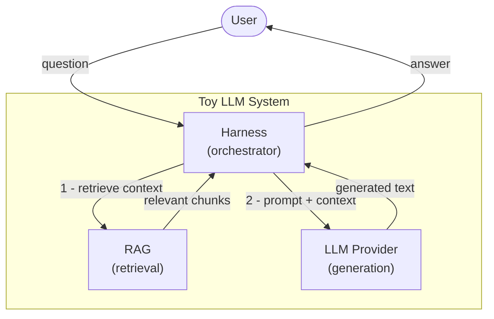
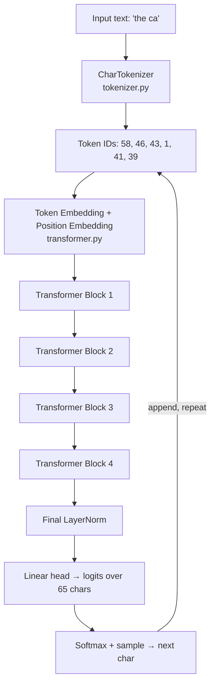
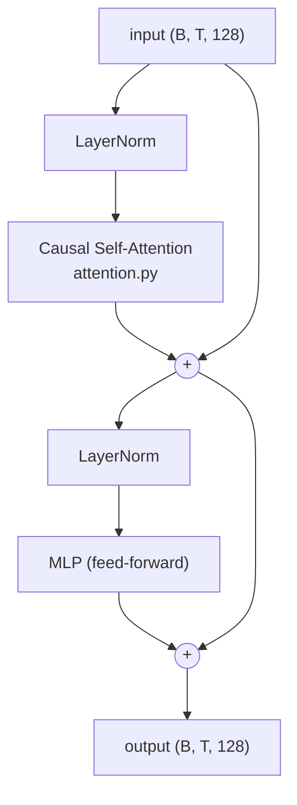
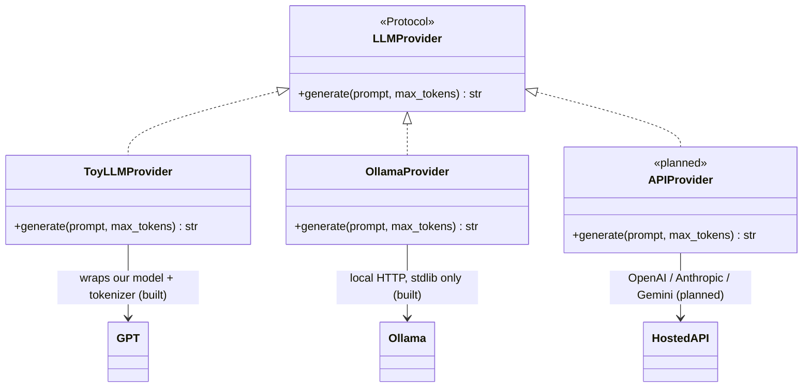
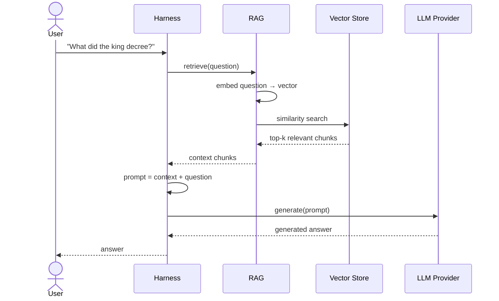

# Architecture

This document explains how the project is put together, why it was built this way, and how the three pieces — **LLM**, **harness**, and **RAG** — fit into one system.

For the *why behind each concept* (embeddings, attention, etc.) see [`docs/concepts/`](concepts/). This document is focusing on the *system*, not the math.

---

## The main goal

> **Learn how an LLM works under the hood by building one — and the system around it — from scratch, with nothing hidden.**

Every decision in this project is subordinate to that goal. The model is deliberately tiny. The dataset is small. There are no frameworks doing invisible work. If something happens, it happens in code you can read in an afternoon.

We are building three things, in order:

1. **The LLM** — a GPT-style transformer that generates text. *(built)*
2. **The harness** — a thin orchestrator that connects components and abstracts the LLM behind a swappable interface. *(built — toy + Ollama providers)*
3. **RAG** — retrieval that feeds relevant context into the LLM at generation time. *(built — SQLite vector store)*

---

## System overview

The three components are **loosely coupled**. The harness is the only piece that knows about the others; the LLM and RAG never call each other directly. This is what lets us build, understand, and swap each one in isolation.



The flow is always the same: the harness receives a question, asks RAG for relevant context, stitches that context into a prompt, hands the prompt to whatever LLM provider is configured, and returns the result.

---

## What exists today

| Component | Status | Where |
|---|---|---|
| LLM (tokenizer, attention, transformer, training) | ✅ Built | `model/` |
| Harness + `LLMProvider` abstraction | ✅ Built | `harness/` |
| Providers: `ToyLLMProvider`, `OllamaProvider` | ✅ Built | `harness/` |
| RAG (chunking, embedding, SQLite vector store, retrieval) | ✅ Built | `rag/` |
| RAG pipeline (retrieve → augment → generate) | ✅ Built | `harness/pipeline.py` |
| Concept documentation | ✅ In progress | `docs/concepts/` |
| Tests (79) | ✅ Built | `tests/` |

Every component in the original plan is now built. The rest of this document describes how each one works and the contracts that keep them swappable.

---

## Component 1 — The LLM (built)

A character-level, GPT-style decoder-only transformer. Text goes in, the next character comes out, one at a time.

### The forward pass



The loop at the bottom is **autoregression**: each generated character is appended to the input and fed back in, so the model writes one character at a time.

### Inside one transformer block

All four blocks are identical in structure. This is where tokens exchange information (attention) and then think individually (MLP).



The two `+` nodes are **residual connections** — the block's output is *added to* its input rather than replacing it, so information and gradients always have a clean path through.

### How the four files map to the diagram

| File | Role in the diagram |
|---|---|
| `tokenizer.py` | Text ↔ token IDs (the entry and exit of the whole pipeline) |
| `attention.py` | The "Causal Self-Attention" box inside every block |
| `transformer.py` | Embeddings, the blocks, the final head, and `generate()` |
| `train.py` | Runs the forward pass over Shakespeare, computes loss, updates weights |

Deeper explanations live in [`docs/concepts/001-embeddings.md`](concepts/001-embeddings.md) and [`docs/concepts/002-qkv.md`](concepts/002-qkv.md).

---

## Component 2 — The Harness (built)

The harness has two jobs: **orchestration** (the flow shown in the system overview) and **abstraction** (hiding *which* LLM is being used behind a single interface).

### The provider abstraction

Our toy `GPT` is just one possible LLM. We want to be able to swap in a local open-source model (via Ollama) or a hosted model (via an API key) without changing any other code. A small `Protocol` makes every LLM look the same to the harness:



Both providers exist today:

- **`ToyLLMProvider`** is a thin adapter: it takes a string prompt, encodes it with `CharTokenizer`, calls `GPT.generate()`, and decodes the result back to a string. The model code in `model/` stays clean — it knows nothing about prompts, RAG, or providers.
- **`OllamaProvider`** talks to a locally running Ollama server over HTTP using only the standard library — no new dependencies. Same `generate(prompt, max_tokens) -> str` call, an entirely different model behind it.

A hosted-API provider (OpenAI / Anthropic / Gemini) would be one more class implementing the same one-method interface; nothing else would change.

**Why this matters for learning:** the abstraction has already paid off. The *same* `provider.generate(...)` call drives both the hand-built 832K-parameter toy model and a 14-billion-parameter `qwen2.5-coder` running locally through Ollama — identical code path, wildly different capability. Feeling that contrast directly is one of the most instructive things in the whole project.

### Running it

```bash
python -m harness                                      # the toy model (needs a trained checkpoint)
python -m harness --provider ollama --model qwen2.5-coder:14b
```

---

## Component 3 — RAG (built)

A language model only knows what it learned during training. **Retrieval-Augmented Generation** fixes this by fetching relevant text from an external knowledge base at question time and inserting it into the prompt — so the model can answer using information it was never trained on.

RAG has two phases.

**Indexing (done once, ahead of time):**
1. Split your documents into chunks.
2. Convert each chunk into an embedding vector (a list of numbers capturing its meaning).
3. Store the vectors in a vector store.

**Retrieval (done per question):**
1. Embed the question with the same embedding model.
2. Find the chunks whose vectors are most similar to the question's vector.
3. Return those chunks as context.

### End-to-end flow

This sequence shows everything working together — the harness mediating between the user, RAG, and the LLM provider:



Note that the **embedding model used by RAG is separate from the LLM** that generates text. RAG embeddings are about *similarity search*; the LLM is about *generation*. Keeping them distinct is itself a useful concept to internalize.

### What's built

| Piece | File | Role |
|---|---|---|
| `chunk_text` | `rag/chunk.py` | Splits documents into overlapping passages |
| `OllamaEmbedder` | `rag/embed.py` | Text → vectors via Ollama (`nomic-embed-text`), stdlib HTTP |
| `VectorStore` + `SqliteStore` | `rag/store.py` | A swappable store abstraction; SQLite is the one backend today |
| `Retriever` | `rag/retriever.py` | `index(documents)` and `retrieve(query, k) -> list[str]` |
| `RAGPipeline` | `harness/pipeline.py` | Ties retrieval to a provider: retrieve → augment → generate |

**SQLite stores, torch searches.** `SqliteStore` persists each `(text, embedding)` pair to a single file (`data/rag.db`), the vector as a float32 BLOB. At query time it loads the vectors into a tensor and computes cosine similarity in torch — SQLite does no vector math. That store-vs-search split is the key concept: a vector database is just *storage + a similarity search*, and here you see both halves.

**The store is swappable.** `Retriever` depends on the `VectorStore` interface, not on SQLite — a future Postgres/pgvector or FAISS backend is one new class with `add` / `search` / `count`, nothing else changing. Same pattern as `LLMProvider`.

One honest caveat worth internalizing: retrieval has **no relevance threshold** — it always returns the *k nearest* passages, even when none are truly relevant. That is why an off-topic query still returns *something*.

### Running it

```bash
ollama pull nomic-embed-text             # one-time: a dedicated embedding model
python -m rag "how does Q/K/V work?"     # retrieval only — prints the top passages
```

For a full grounded answer, `RAGPipeline` retrieves passages and feeds them to any provider (`harness/pipeline.py`).

---

## Architecture decisions

Every choice below trades production-grade capability for **learnability**. The simpler option was chosen on purpose whenever it still demonstrates the underlying concept honestly.

| Decision | What we chose | Why (for learning) |
|---|---|---|
| **Tokenizer** | Character-level (65-token vocab) | The entire vocab fits on screen; the tokenizer is ~10 lines. BPE/subword would hide the mechanics behind a trained algorithm. |
| **Model size** | ~832K parameters | Trains on a laptop CPU in minutes. Every architectural concept (attention, residuals, layer norm) is present at full size — only the dimensions are small. |
| **Framework** | PyTorch | Autograd handles backpropagation so you can focus on *architecture*, not hand-deriving gradients. Raw NumPy would bury the concepts under calculus plumbing. |
| **File count** | 4 files, one concept each | No package sprawl. You can hold the whole model in your head. |
| **Dataset** | Tiny Shakespeare (~1 MB) | Small enough to train fast, structured enough that progress is visible and fun (names, dialogue, verse). |
| **LLM abstraction** | A thin `Protocol`, hand-written | Lets the toy model and real models be swapped freely — without pulling in a framework that hides the wiring. |
| **Vector store** | A single SQLite file + cosine in torch, behind a `VectorStore` interface | Stdlib persistence with the similarity math kept visible; no vector DB to hide the search. Swappable for pgvector/FAISS later. |
| **Component coupling** | LLM / harness / RAG fully decoupled | Each can be built and understood in isolation. The harness is the only integration point. |
| **No orchestration framework** | Build the harness and RAG by hand | Frameworks like LangChain do exactly what we want to *learn*. Doing it manually is the whole point. |

---

## Design boundaries (the contracts)

These are the rules that keep the components swappable. They are worth stating explicitly because they are easy to violate accidentally:

- **`model/` knows nothing about prompts, RAG, or providers.** It deals in token IDs and tensors. It is a pure model.
- **The provider adapter is the only place that bridges tokens ↔ strings** for our toy model. Other providers (Ollama, OpenAI) already speak strings.
- **`harness/pipeline.py` is the only component that imports both `rag` and a provider.** RAG and the providers never import each other — and a test fails if `rag/` ever imports `model/` or `harness/`.
- **RAG returns text, not tokens.** It produces context strings; turning them into model input is the provider's concern.

---

## Roadmap

1. ✅ **LLM** — tokenizer, attention, transformer, training loop.
2. ✅ **Harness skeleton** — `LLMProvider` Protocol + `ToyLLMProvider` around the trained checkpoint.
3. ✅ **Wire a real provider** — `OllamaProvider` (stdlib HTTP), compared against the toy model through the same interface.
4. ✅ **RAG** — chunking, Ollama embeddings, a SQLite vector store, and `retrieve()`.
5. ✅ **Connect everything** — `RAGPipeline` retrieves, builds the prompt, calls the provider, returns the answer.

Each step is small, self-contained, and adds exactly one concept to the picture.
